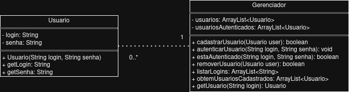
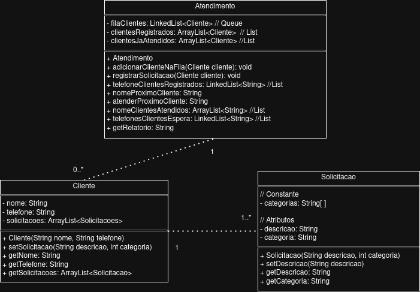
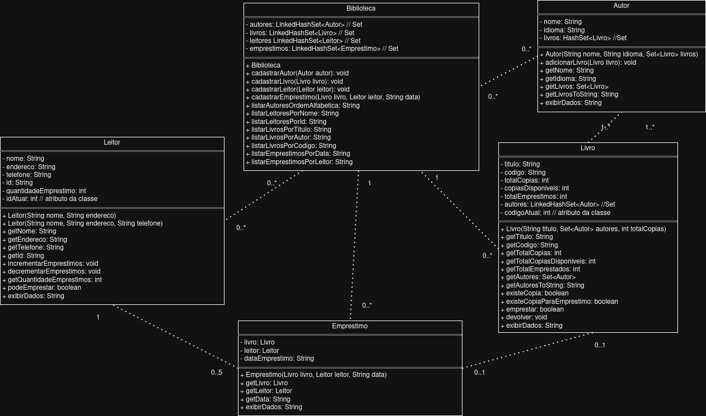

# Aluno: Igor da Silva
# Turma: 129003 - Engenharia de Telecomunicações - IFSC câmpus São José
# Disciplina: Programação Orientada à Objetos - POO

# Lista 3: Diagramas de classe

## Estrutura: 
- A lista possui três questões, cada qual deverá ser resolvida por um arquivo diferente, no qual cada arquivo possui o seu método main.

- Cada arquivo está em um packgage específico. Acesse app/src/main/java. Nesta pasta "java" há o package ifsc (App.java padrão); package ifsc_login para a classe Login.java (questão 1); package ifsc_atendimento para a classe Atendimento.java (questão 2); e package ifsc_biblioteca para a classe Biblioteca.java (questão 3).

- A execução de cada classe é indivual. Por exemplo, se utilizar o compilador VSCODE, abra a classe desejada e clique no botão "RUN" para executar tal classe.

## Lista 3: Questões
### Questão 1 - Sistema de Login
Uma aplicação web está sendo desenvolvida para gerenciar usuários registrados. Cada usuário possui
um login único e uma senha. Os logins devem ser tratados de forma insensível a maiúsculas/minúsculas
(“user”, “User” e “uSeR” são considerados iguais). O sistema deve centralizar o gerenciamento dos
usuários em uma estrutura de dados única e estática, dispensando a criação de instâncias. Para isso, deve
ser utilizada uma classe utilitária, com todos os dados e métodos implementados como membros static.

Requisitos funcionais:

• Cadastrar novos usuários a partir de login e senha, garantindo que logins não se repitam.

• Remover usuários com base em seu login.

• Listar os logins de todos os usuários cadastrados, preservando a ordem de cadastro.

• Autenticar usuários, verificando se login e senha correspondem a um usuário existente.

### Questão 2 - Fila de Atendimento
Uma empresa precisa organizar o atendimento de clientes conforme a ordem de chegada das solicitações.
Cada cliente possui um nome e um número de telefone único, informados na primeira solicitação. Um
mesmo cliente pode realizar múltiplas solicitações. Cada solicitação inclui uma descrição textual e
uma categoria, que deve ser uma das seguintes: “Suporte Técnico”, “Informação” ou “Atendimento
Financeiro”.

Requisitos funcionais:

• Registrar novas solicitações de atendimento, vinculadas ao nome e telefone do cliente.

• Listar os telefones de todos os clientes já registrados.

• Imprimir o nome do próximo cliente da fila.

• Atender o próximo cliente da fila.

• Listar os nomes dos clientes já atendidos.

• Listar os telefones dos clientes ainda em espera.

• Gerar relatório estatístico contendo:

-- Total de solicitações registradas, atendidas e em espera.

-- Distribuição percentual das solicitações por categoria

### Questão 3 - Biblioteca de Livros
Uma pequena biblioteca comunitária deseja informatizar o controle do acervo e dos empréstimos. A
biblioteca possui múltiplas cópias de cada livro. Cada livro possui um título e um código ISBN (utilize
String) como identificador único, e está associado a um ou mais autores. Cada autor possui nome e
idioma nativo, e pode estar vinculado a vários livros. A biblioteca também gerencia leitores, armazenando
nome, endereço e telefone. Cada leitor deve receber um id único, atribuído automaticamente no momento
do cadastro.

O sistema deve manter um registro de todos os empréstimos realizados, associando leitores e livros com a
data do empréstimo.

Requisitos funcionais:

• Cadastrar autores, livros e leitores.

• Registrar empréstimos de livros para leitores, desde que:

-- Haja pelo menos uma cópia disponível do livro.

-- O leitor ainda não tenha esse livro emprestado.

-- O leitor possua menos de 5 livros emprestados.

• Listar dados da biblioteca, incluindo:

-- Autores, em ordem alfabética.

-- Leitores, em ordem alfabética e por id.

-- Livros, ordenados por título, por autor e por ISBN.

-- Empréstimos, por data.

-- Empréstimos de um leitor específico, por data.

## Lista 3: Diagramas de classes UML
Seção dedicada para os diragramas de classes UML da lista 3.

### Questão 1: Login

### Questão 2: Atendimento

### Questão 3: Biblioteca

